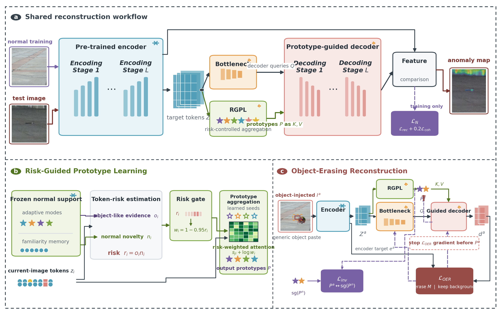

# OAL-FOD

Official research code and PaveFOD dataset for **Object-Aware Learning for
Open-Set Foreign Object Debris Detection**.



OAL-FOD learns from normal target-domain pavement images and externally
sourced non-FOD objects. It does not use target-domain FOD images or FOD
annotations for training. The two main components are Risk-Guided Prototype
Learning (RGPL) and Object-Erasing Reconstruction (OER).

## Repository contents

- `src/fod_recon_ad/`: model components, losses, data handling, and metrics
- `scripts/`: training, familiarity-memory construction, and evaluation tools
- `tests/`: focused unit tests for exported OAL-FOD components
- `docs/PAVEFOD_DATASET_CARD.md`: dataset composition, splits, and limitations
- `docs/REPRODUCIBILITY.md`: environment and workflow notes
- `tools/prepare_pavefod_release.py`: audited dataset-release builder

The repository does not redistribute VisDrone, UAVVaste, INP-Former,
Dinomaly, pretrained backbone weights, or trained checkpoints. Their original
licenses and access terms apply.

## PaveFOD download

PaveFOD v1.0.0 is attached to the matching GitHub release:

- [PaveFOD-v1.0.0.zip](https://github.com/Perfectfox/OAL-FOD/releases/download/v1.0.0/PaveFOD-v1.0.0.zip)
- [SHA-256 checksum](https://github.com/Perfectfox/OAL-FOD/releases/download/v1.0.0/PaveFOD-v1.0.0.zip.sha256)

Archive SHA-256: `3dbd65170a5c94ede185bb37e8d71eb2e3a9b184dab01c455bdaac6c144ace81`

Command-line download:

```bash
gh release download v1.0.0 \
  --repo Perfectfox/OAL-FOD \
  --pattern 'PaveFOD-v1.0.0.zip*'
sha256sum -c PaveFOD-v1.0.0.zip.sha256
unzip PaveFOD-v1.0.0.zip
```

The release contains 87 privacy-filtered RGB images at 2560 x 1440, 83 binary
masks, 83 instance masks, the fixed validation/test split, and metadata for all
198 annotated objects. Pixels inside the verified pavement ROI are preserved
exactly; pixels outside it are replaced with white to remove people and
unrelated background content. Camera IP addresses and capture timestamps are
not present in released filenames or metadata.

## Installation

Python 3.10 or newer is recommended.

```bash
python -m venv .venv
source .venv/bin/activate
pip install -e '.[test]'
export PYTHONPATH="$PWD/src:$PWD/scripts"
```

The reconstruction interface uses code from
[INP-Former](https://github.com/zhangzjn/INP-Former) and
[Dinomaly](https://github.com/guojiajeremy/Dinomaly). Clone them separately and
pass their locations using `--inpformer-repo` and `--external-repo`.

## Workflow

```bash
python scripts/train_reconstruct.py --help
python scripts/rebuild_familiarity_memory.py --help
python scripts/build_adaptive_center_teacher.py --help
python scripts/train_reconstruct_object_erasing.py --help
python scripts/eval_sliding_reconstruct.py --help
```

The intended order is normal reconstruction training, familiarity-memory
construction, adaptive teacher packaging, OER training, and sliding-window
evaluation. See [the reproducibility guide](docs/REPRODUCIBILITY.md) for dataset
paths and the external-object dependency.

Run the focused tests with:

```bash
pytest -q
```

## Licenses and citation

The source code is released under the [MIT License](LICENSE). PaveFOD is
released separately under [CC BY-NC 4.0](DATASET_LICENSE.md). Citation metadata
with the confirmed paper-author order is available in
[`CITATION.cff`](CITATION.cff).
